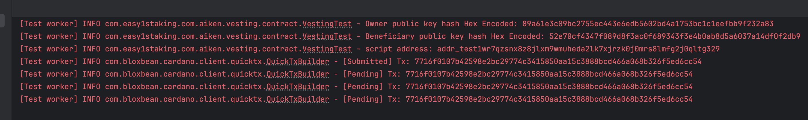
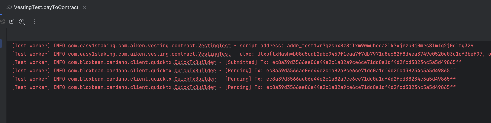

# Aiken + Java - Vesting Contract

In this repository you will find the famous [Vesting](https://aiken-lang.org/example--vesting) Cardano Plutus contract 
developed with [Aiken](https://aiken-lang.org/) along with the Java code required to use it on the Cardano `preprod` testnet.

## Requirements

* [Aiken](https://aiken-lang.org/), version 1.0.29-alpha
* [Java](https://www.oracle.com/java/technologies/downloads/)
* A [Blockfrost](https://blockfrost.io/) key for the Cardano `preprod` network

**IMPORTANT** We discourage running this code on the Cardano `mainnet` as it might lead to permanent loss of funds! We
assume no responsibility over lost or locked funds. 

## Folders

The [vesting](vesting) folder contains the code for the Aiken Smart Contract

The [java](java) folders contains the java code to interact w/ the Smart Contract

# Usage 

The first step is to compile the smart contract and build the so called blueprint file: `plutus.json`.

In order to do so, change directoy into `vesting` and run `aiken build`. 

If don't have `aiken` installed, please refer to the official documentation here [Aiken](https://aiken-lang.org/).

If everything worked well, you should have a file in this location `vesting/plutus.json`, from the root of the project
run `cat vesting/plutus.json`, you should see a json containing relevant info about your smart contract.

You can interact with the Vesting smart contract by running the tests in the java project.

In particular you can open the `VestingTest` class in which you will find three test cases:

1. `payToContract` is the test responsible for locking funds in the vesting contract. Feel free to play around with the datum
data like the owner key, the beneficiary key or the locking time.
2. `withdraw` is the test that allows the owner to withdraw at any time the funds sent to the beneficiary if they weren't yet collected
3. `collect` is the test that allows the beneficiary to collect their funds once the lock time has passed.

# Running Tests step by step

Open the `VestingTest.java` class and run the `payToContract()` test as is. After a few seconds it should start printing
some logs as below. Please take note of the transaction hash in your logs. In the example below the transaction hash is
`7716f0107b42598e2bc29774c3415850aa15c3888bcd466a068b326f5ed6cc54`

The `payToContract()` test makes the wallet of the owner to pay (lock) a certain amount of ada in the contract. Along with 
the ada, a certain amount of info is attached in the datum of the contract. In particular we have:
1. the public key of the owner
2. the public keu of the beneficiary
3. a timestamp representing the moment in time since when the beneficiary can collect its funds

Let's make the owner now withdraw its funds: copy the transaction hash from the logs, and paste it into the `transactionHash` variable
of the `withdraw()` test method and run it.

When running the code, the logs will look similar.

We successfully _cancelled_ the vesting operation. So if we want to test the collect case, we need to execute again the `payToContract`
test, wait the amount of time required for the contract to allow vesting, and then execute the `collect` test.

By default in the code it's hardcoded to 30 minutes, but you get play around different value to accelerate your testing.
